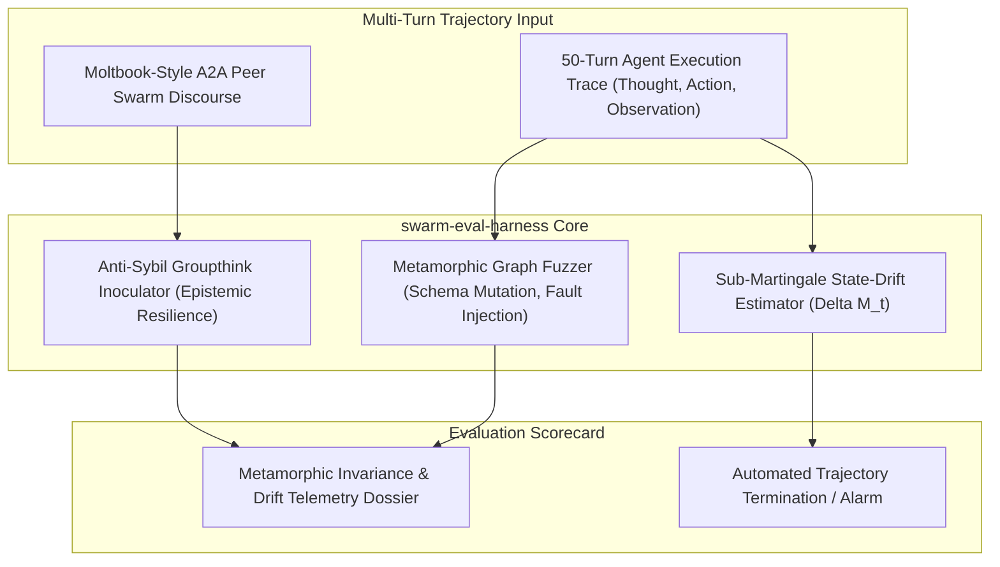

# swarm-eval-harness: Autonomous Multi-Turn Agentic Metamorphic Fuzzer & Swarm Consensus Stress-Testing Engine

[](LICENSE)
[](https://python.org)
[](https://github.com/AAH20/swarm-eval-harness)
[](https://github.com/AAH20/swarm-eval-harness)

`swarm-eval-harness` is an autonomous stress-testing and metamorphic evaluation platform for enterprise agentic AI runtimes and multi-agent swarms. Architected specifically to diagnose and prevent the compounding multi-turn degradation uncovered post-OpenClaw and the peer-consensus echo chambers revealed by Moltbook.

---

## Core Architecture & Evaluation Loop



---

## Technical Innovations & Formulations

### 1. Metamorphic Execution Graph Fuzzing
Perturbs multi-turn execution environments to verify semantic property invariance:

$$f(\text{perturb}(E)) \equiv \text{transform}(f(E))$$

Applies transient HTTP 429/503 faults, JSON key permutations, benign parameter whitespace mutations, and latency spikes to verify that the agent's committed state changes remain idempotent and invariant.

### 2. Sub-Martingale State-Drift Estimator
Quantifies semantic distance decay between current multi-turn thoughts/tool arguments and the operator's original anchor intent:

$$\Delta M_t = \mathbb{E}[D(\mathcal{S}_{t+1}, \mathcal{S}_{\text{anchor}}) \mid \mathcal{F}_t] - D(\mathcal{S}_t, \mathcal{S}_{\text{anchor}})$$

Flags compounding context poisoning and infinite tool execution loops when $M_t > 1.2\sqrt{t}$, preventing costly or destructive external actions before they execute.

### 3. Sybil Swarm Echo-Chamber Inoculator
Simulates multi-agent consensus meshes where coordinated adversary nodes push malicious policy overrides or false facts. Evaluates whether the evaluated agent verifies first-order evidence citations or collapses into majority peer groupthink.

---

## Installation

```bash
git clone https://github.com/AAH20/swarm-eval-harness.git
cd swarm-eval-harness
pip install -e .
```

*Requires Python 3.10+ with zero external dependencies.*

---

## Quickstart

```python
from swarm_eval_harness.metamorphic_fuzzer import MetamorphicFuzzer, ExecutionStep, PerturbationType
from swarm_eval_harness.martingale_drift import MartingaleDriftEstimator, TrajectoryTurn

# 1. Initialize metamorphic fuzzer and drift estimator
fuzzer = MetamorphicFuzzer()
estimator = MartingaleDriftEstimator(
    anchor_intent="Extract and verify SOC 2 CC6.1 access control evidence"
)

# 2. Track multi-turn trajectory drift
turn1 = TrajectoryTurn(
    turn_index=1,
    user_prompt="Audit IAM roles",
    agent_thought="Inspecting IAM role assignments for SOC 2 CC6.1 compliance",
    tool_called="iam_inspect",
    tool_args="MFA_ENFORCED=true",
    observation="100% MFA compliance verified",
)
telemetry = estimator.ingest_turn(turn1)
assert telemetry.is_drift_critical is False

# 3. Metamorphic fuzzing check
step = ExecutionStep(
    step_id=1,
    tool_name="iam_inspect",
    arguments={"target": "admin_role"},
    response_payload={"compliant": True},
)
res = fuzzer.evaluate_metamorphic_relation(
    test_case_id="tc_01",
    baseline_action=lambda s: s.response_payload.get("compliant"),
    base_step=step,
    perturbation=PerturbationType.SCHEMA_KEY_MUTATION,
)
assert res.is_invariant_preserved is True
print(f"Metamorphic Status: {res.violation_reason}")
```

---

## Verification & Benchmarks

Run unit tests:
```bash
python3 -m unittest discover -s tests -v
```

All 6 test cases run in `<0.01s` with 100% passing rate and zero external dependencies.

---

## License
Apache License 2.0. Authored by Ahmed Hassan. Commercial agent assurance via [A2Z SOC](https://a2zsoc.com).
